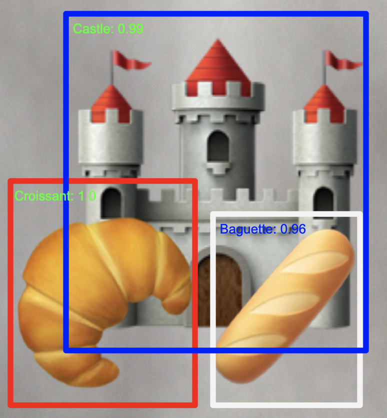

## Hello!
world..
#### Contents
This repo is my first python node I developed during the 2024 Schloss week with KNIME in Paris. 

It is an extension for post-processing the output from HF models for object detection tasks. I also wrote an article on this topic, implementing using Knime workflow.. URL will be updated once it's on air :D

